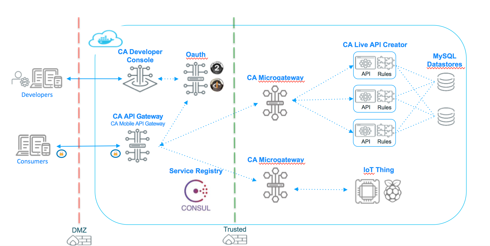

# Microservices Demo (MSD): Microservice creation, discovery, consumption, and enforcement 

The folder structure contains the iOS app and Docker application. Navigate to the [Docker README](docker) to get started.

